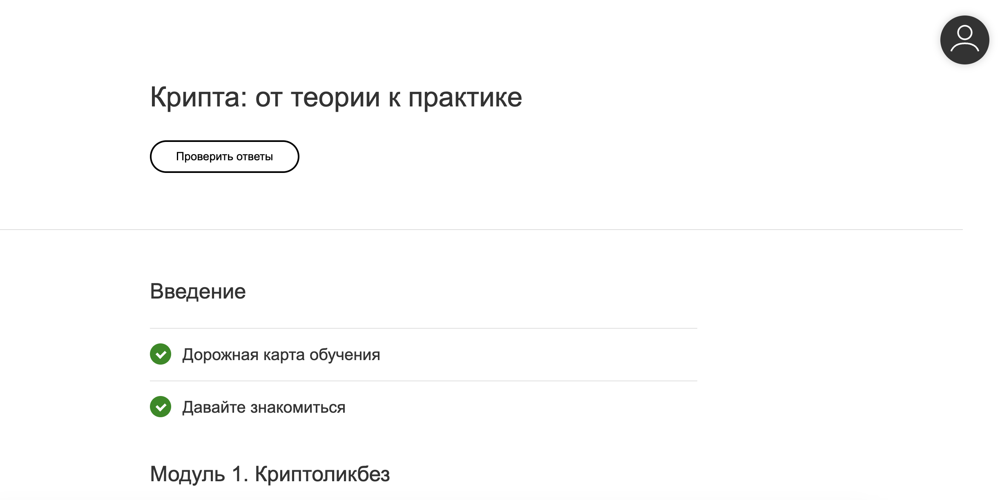

## Описание учебных курсов

### Крипта: от теории к практике

#### Описание
Учебный курс "Крипта: от теории к практике" погрузит вас в историю блокчейна, объяснит что представляют из себя криптовалюты, как устроен майнинг и многое другое.
Достаточно интреесный курс с практическим уклоном, позволяющий вам познакомится с основами криптовалют, создать свой криптокошелек и многое другое.

#### Пререквизиты
**Ссылка на курс:** [https://m.online.itmo.ru](https://m.online.itmo.ru)

**Трудозатраты:** Трудозатраты +- 16 часов (Практические занятия)

#### Метод оценивания
Вам необходимо прочитать/прослушать все лекции и выполнить все практики и финальное задание. Результаты работы необходимо выложить в таблицу. Данные о среднем проценте будут взяты на основе количества процентов выполненых заданий и изученных лекций.
**Оценка может варьироваться от 0 до 100%.**

#### Сроки выполнения
У вас не больше 4-ух недель от старта занятий для выполнения данного задания. 

### Kusama - From Theory to Practice

#### Описание
Учебный курс "Kusama - From Theory to Practice" познакомит вас блокчейн сетями Kusama и robonomics.network созданной выпускниками ИТМО. Расскажет о использовании технологий распределенного реестра в задачах управления и хранения данных от IoT устройств, роботов и многого другого. Помимо этого у курса есть продолжение по роботу Spot от Boston Dynamics, с управлением роботом Spot в реальном времени.

#### Пререквизиты
**Ссылка на курс:** [Kusama — From Theory to Practice Course](https://kap2fox.github.io/kusama.practice/en/learn/kusama-theory-practice/overview/)

**Трудозатраты:**  Трудозатраты 16 часов (Практические занятия)

#### Метод оценивания
Вам необходимо прочитать все лекции и выполнить все практики. После окончания всех заданий вам необходимо запросить IPFS сертификат о прохождении курса. Результаты работы необходимо выложить в таблицу. Получение IPFS сертификата предполагает что курс выполнен на 100%, курс без получения IPFS сертификата не считается пройденым.

#### Сроки выполнения
У вас не больше 4-ух недель от окончания предыдущего задания для выполнения данного задания. 

### Онлайн лекционный курс на eDEX по Kubernetes

#### Описание
Онлайн **лекционный курс** на eDEX по Kubernetes **является справочным, платить за курс не надо**, также дополнительно будут проводится лекции на русском языке уточняющие и расширяющие некоторые моменты из этого курса. Помимо этого будет 4 лабораторных работы по теме онлайн и офлайн лекций для проверки ваших знаний.
#### Пререквизиты
**Ссылка на курс:** [Introduction to kubernetes](https://www.edx.org/course/introduction-to-kubernetes)

**Трудозатраты:** Трудозатраты +- 20 часов (Практические занятия)

#### Метод оценивания
Вам необходимо прочитать/прослушать все лекции и выполнить все лабораторные работы. Результаты работы необходимо выложить в таблицу. Формат защиты лабораторных работ будет сообщен дополнительно.
Оценка может варьироваться от 0 до 100%.

#### Сроки выполнения
У вас не больше 6-и недель от окончания предыдущего задания для выполнения данного задания. 

### Написание технической статьи на Medium или Habr
#### Описание
Самое интересное задание из всех представленных, вам необходимо будет разработать и разместить техническую статью на Medium или Habr по любой из заинтересовавших вас тем которые будут рассмотрены на курсе с личного аккаунта.

**Все авторы статьи должны быть указанны в ней на момент публикации.**

#### Пререквизиты

**Трудозатраты:** Трудозатраты +- 6 часов (Самостоятельная работа)

Глубину статьи вы оцениваете самостоятельно, но к самой статье есть несколько требований:

1. НИКАКОЙ РЕКЛАМЫ ТОКЕНОВ/ТЕХНОЛОГИЙ
2. В случае если вы делаете обзор технологии/токена, вам необходимо привнести свою аналитику данной технологии/токена с технической/математической точки зрения.
3. Постарайтесь красиво/качественно оформить свою статью, чтобы ее было приятно читать как вам, так и случайным посетителям ресурса на который вы выкладываете свою статью.
4. Требование для статьи на Medium - Объем статьи на одного человека не менее 6 минут на прочтение, Medium сам это оценивает.
5. Требование для статьи на Habr - необходимо чтобы плюсов было больше чем минусов.

**Ссылки на полезные материалы для подбора тем:**    
- [Introduction and Issues in distributed system](https://ds.cs.luc.edu/issues/issues.html)    
- [Open Issues and Security Challenges of Data Communication Channels in Distributed Internet of Things (IoT): A Survey](https://www.researchgate.net/publication/322814035_Open_Issues_and_Security_Challenges_of_Data_Communication_Channels_in_Distributed_Internet_of_Things_IoT_A_Survey)   
- [Distributed Systems Security Knowledge Area](https://www.cybok.org/media/downloads/Distributed_Systems_Security_issue_1.0.pdf)   
- [Google research for Distributed Systems and Parallel Computing](https://research.google/research-areas/distributed-systems-and-parallel-computing/)   
- [PhD research topic in parallel and distributed systems](https://phdprojects.org/phd-research-topic-parallel-distributed-systems/)   
- [Research at Web3 Foundation](https://research.web3.foundation/en/latest/index.html)   
- [Ethereum research backlog](https://notes.ethereum.org/@ethsg/rkxpeG0ff?type=view)   
- [Материалы прошлых лет](https://itmo-ict-faculty.github.io/introduction-to-distributed-technologies/student_case/itmo2022_2023/itmo2022_2023/)

#### Метод оценивания
В ходе оценки статьи будут оцениваться следующие параметры:

- Техническое содержание и новизна идеи
- Объем статьи и количество  использованных интересных источников/материалов
- Оценки от комментаторов статьи, результаты конструктивной критики.

**Оценка может варьироваться от 0 до 100%.**

#### Сроки выполнения
Вам необходимо приложить ссылку на статью не позднее чем за две недели до окончания учебной дисциплины. 
